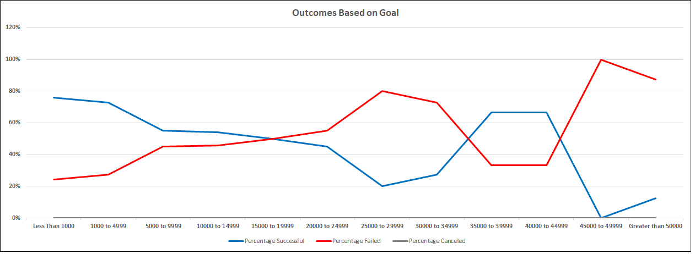

# Kickstarter-Challenge
This is Challenge 1 (Excel) - Analysis on Kickstarter

### Project Background
The purpose of this analysis is to help a playwright, Louise, who wants to start a crowdfunding campaign to help fund her play “Fever”. She’s estimating a budge of over $10,000.00. Since this is Louise’s first fund raising campaign, she wants to analyze the crowd funding site’s data to determine whether there are specific factors that make a project campaign successful.  This analysis will help her gain an insight into successful campaigns so she can set her campaign to mirror other successful ones in the same category.  
### Purpose:
To help Louise, some analysis such as sorting, filtering, and making the data more readable has been performed.  Additional analysis using pivot tables and charts on parent categories and subcategories has been performed as well.
Louise’s play Fever came close to its fundraising goal in a short amount of time. Now, she wants to know how different campaigns fared in relation to their launch dates and their funding goals. 
Two new analyses are now required 
-	Theater outcomes based on launch date
-	Outcomes based on goals

## Analysis and Challenges:
### Theater outcomes based on the Launch Date:
For this analysis, first the Year column was created in the Kickstarter spreadsheet ([Kickstarter_Challenge.xlsx](/Kickstarter_Challenge.xlsx), so we can break the campaign create date data further to see which month each campaign had started.    Then a pivot table was created to show the total count of various outcomes (successful, failed, and canceled) for each create month of the Year for the “theater” category. 
Then a line chart was created so we can quickly visually see if there are any relationships between campaign launch (create) month and the campaign’s outcomes (successful, failed, canceled). 

Insert picture of PNG chart based on the launch date.

### Outcomes based on goals:
The purpose of this analysis is to use Excel to visualize the percentage of successful, failed, and canceled plays based on the funding goal amount. 

In a new spreadsheet, a Goal column was created which listed dollar amount ranges so that the project can be grouped based on their goal amount.
For each funding goal category, the total number of successful, failed, canceled campaigns outcomes was calculated.  Then for each funding goal category, the percentage of successful, failed, and canceled campaign outcomes was also calculated. COUNTIFS function was used to collect the outcome and goal data for the “plays” subcategory. 
Total number of projects (total projects column) was calculated using the SUM formula.  Percentages of successful projects was calculated by dividing total number of successful projects by the total number of projects.  Failed and canceled percentages were calculated similarly.
A line chart is created to visualize the relationship between the goal-amount ranges on the x-axis and the percentage of successful, failed and canceled projects on the y-axis.

Insert picture of PNG chart based on the goal

### Challenges and Difficulties Encountered
The analysis was not difficult; however, it was challenging as the formulas used to calculate the total number of each outcome (successful, failed, and canceled) for each goal category needed to be carefully entered and the final totals needed to be crosschecked for accuracy.
Also, the outcomes based on the goals chart required some research on the internet to figure out how to remove the total columns from the chart and keep only the percentage columns in the chart.

## Results:
1.	Theater outcomes by Launch Date Results:
 Based on the Theater outcomes by Launch Date, we can see that theater campaigns which were launched in May, June, and July has the highest success rate vs theater campaigns which were launched in other months.  Theater campaigns launched in May had the highest success rate whereas theater campaign launched in December had the least success rate. The highest number of failed campaigns were also in the month of May. The canceled campaigns remained uniform throughout the year.  
2.	Outcomes based on goals Results
There were no canceled projects in the “theater” parent category. As there were no canceled projects, the relationship between the successful projects and failed projects was inverse. For the projects that had less than $15000 goal amount, the successful rate was higher than failed rate.   For projects that had goals were between $15000 to 35,000 range we saw a shift in the relationship between successful and failed project; there were more failed projects than successful projects in this range. Since Louise’s budget for this project is above $10,000, we are most concerned with the $10,000 to $15000 range.  The chart shows that that the projects in this range have a higher success rate than a failed rate.

### Conclusion:
Based on the analysis of theater outcomes by launch date and analysis of outcomes based on goals, since Louise’ budge is above $10,000, Louise has a higher chance of being successful if she launches her campaign in May and keeps her budget under $15,000.
We can also do additional analysis to see if the campaigns launched in May with budget goals of $10,000 are successful or not. 
